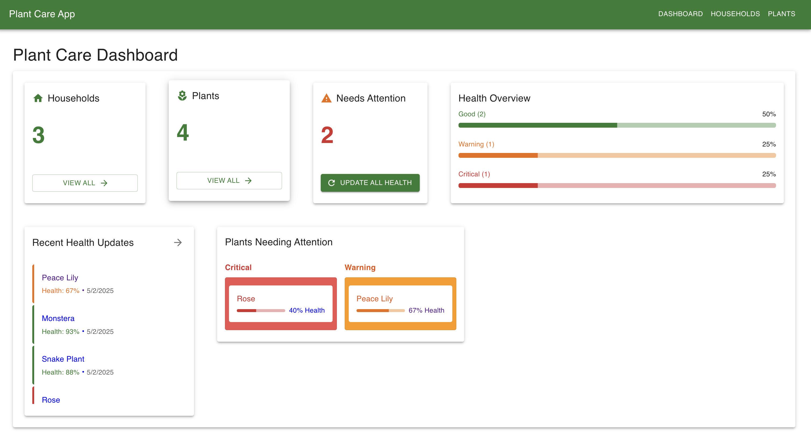
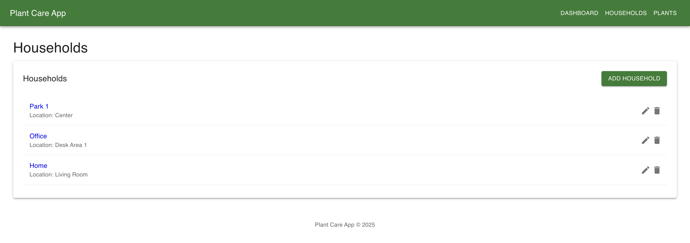
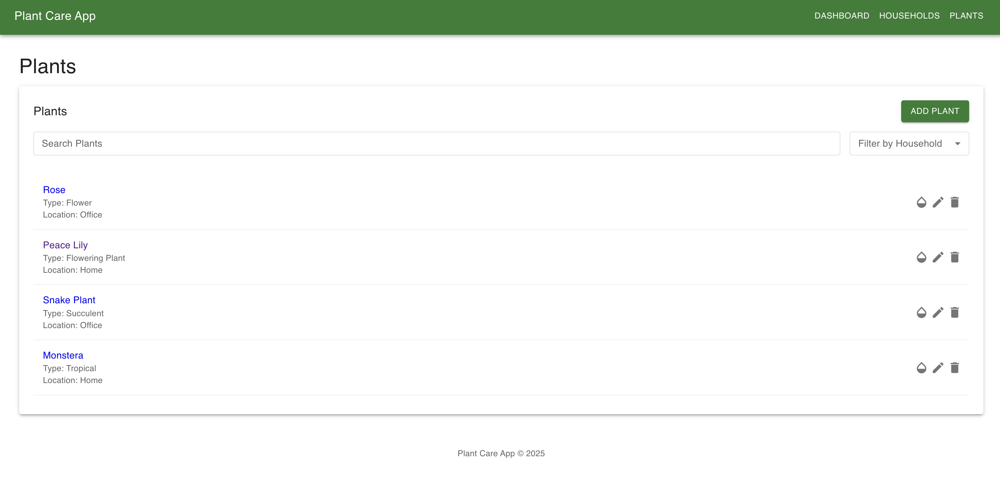

# Plant Care Monitoring Application

A full-stack application that leverages weather data to help users monitor and maintain their plants' health based on environmental conditions.

## Overview

This application allows users to track plants across multiple locations, monitor their health based on actual weather conditions compared to their needs, and visualize historical health data. By comparing expected water/humidity requirements with real-time weather data, the app provides valuable insights into plant care needs.

## Screenshots





## Features

- **Household Management**: Create and manage multiple households/locations
- **Plant Management**: Add, edit, and delete plants with their specific requirements
- **Health Monitoring**: Automated evaluation of plant health based on weather data
- **Historical Tracking**: View health trends over time with customizable date ranges
- **Filtering & Search**: Find plants by name, type, or health status
- **Responsive Design**: Works on both desktop and mobile devices

## Technology Stack

### Backend

- Node.js with Express
- TypeScript for type safety
- MongoDB for data storage
- REST API architecture
- Open-Meteo Weather API integration

### Frontend

- React with TypeScript
- Redux with Redux Toolkit and Redux Observable for state management
- Material-UI for responsive design
- Recharts for data visualization
- React Router for navigation

## Getting Started

### Prerequisites

- Node.js (v14+)
- MongoDB (local installation or MongoDB Atlas account)
- Git

### Installation

1. **Clone the repository**

   ```bash
   git clone https://github.com/semert/plant-care.git
   cd plant-care
   ```

2. **Backend Setup**

   ```bash
   # Navigate to backend directory
   cd plant-care-api

   # Install dependencies
   npm install

   # Create .env file
   echo "PORT=5000
   MONGODB_URI=URL
   NODE_ENV=development" > .env

   # Run development server
   npm run dev
   ```

3. **Frontend Setup**

   ```bash
   # Navigate to frontend directory
   cd ../plant-care-client

   # Install dependencies
   npm install

   # Create .env file
   echo "REACT_APP_API_URL=URL/api" > .env

   # Run development server
   npm start
   ```

4. **Seed Initial Data (Optional)**
   ```bash
   cd ../plant-care-api
   npm run seed
   ```

## Usage

1. **Create Households**: Start by adding one or more households with location details
2. **Add Plants**: Register your plants with their water and humidity requirements
3. **Monitor Health**: View plant health scores based on actual weather conditions
4. **Track History**: Use the historical charts to view trends over time
5. **Filter & Search**: Find specific plants using the search and filter functionality

## API Endpoints

### Households

- `GET /api/households` - Get all households
- `GET /api/households/:id` - Get household by ID
- `POST /api/households` - Create household
- `PUT /api/households/:id` - Update household
- `DELETE /api/households/:id` - Delete household

### Plants

- `GET /api/plants` - Get all plants
- `GET /api/plants/household/:householdId` - Get plants by household
- `GET /api/plants/:id` - Get plant by ID
- `POST /api/plants` - Create plant
- `PUT /api/plants/:id` - Update plant
- `DELETE /api/plants/:id` - Delete plant

### Plant Health

- `GET /api/health/plant/:plantId` - Get health records for a plant
- `GET /api/health/plant/:plantId/range` - Get health records within date range
- `POST /api/health/plant/:plantId/update` - Update health for a plant
- `POST /api/health/update` - Update health for all plants

## Design Decisions

1. **Simplified Authentication**: Opted for a household-based approach instead of user authentication to streamline development and focus on core functionality
2. **Redux Observable**: Chose Redux Observable (RxJS) for handling complex asynchronous operations like API requests and data transformations
3. **Health Calculation Algorithm**: Implemented a weighted algorithm for plant health that considers both water needs and humidity requirements
4. **MongoDB**: Selected MongoDB for its flexible schema which accommodates varied plant metadata
5. **Material-UI**: Used for consistent design patterns and responsive layouts
6. **Open-Meteo API**: Selected for its comprehensive historical weather data and free tier

## Future Enhancements

- User authentication system
- Mobile app version
- Email/SMS notifications for critical plant health
- Plant image uploads
- Integration with smart home devices/sensors
- Advanced analytics and trend predictions
